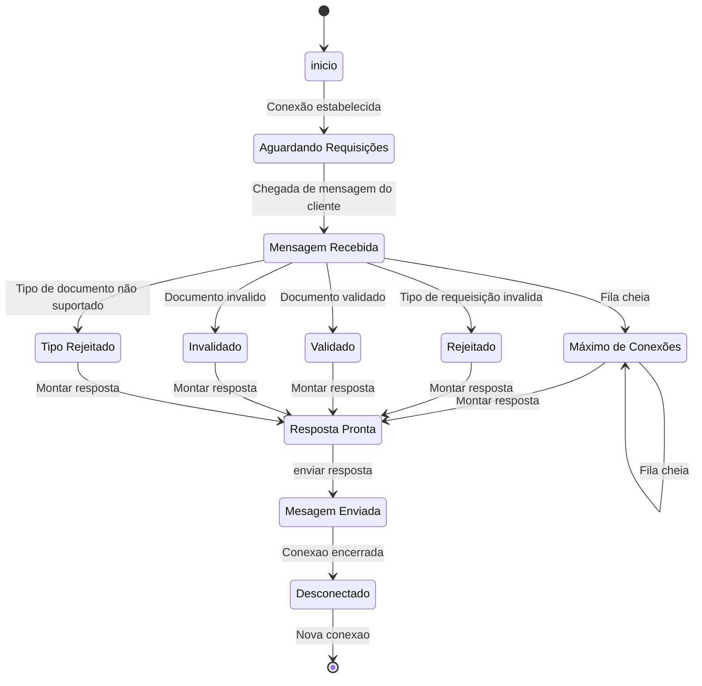

# Provaldo

# Documentação do Protocolo de Validação de CPF/CNPJ

## Introdução

Este documento descreve o Protocolo de Validação de Documentos Alfanuméricos (Provaldo - Protokolo de Validigo de Alfanumeraj Dokumentoj) de camada de aplicação, na arquitetura cliente-servidor, na porta 1996. O protocolo opera utilizando TCP para realizar as comunicações e as mensagens trocadas entre as partes são codificadas em UTF-8.

A implementação original descreve a validação dos documentos CPF (Cadastro de Pessoas Físicas) e CNPJ (Cadastro Nacional da Pessoa Jurídica).

## Formato da Requisição

Todos os campos são caracteres codificados em UTF-8, cada linha é terminada pelos caracteres especiais de *****recuo de carro***** seguido por ******enter.****** O formato da requisição segue o padrão:

```
VALIDE\r\n
DOCN {Número do Documento}\r\n
DOCT {Tipo do Documento}\r\n

```

`DOCN` {} é a linha que contém o número do documento a ser validado.

`DOCT` {} é a linha que contém o tipo do documento a ser validado, onde:

| DOCT | Significado | Utilização | Observação |
| --- | --- | --- | --- |
| 1 | CPF | Requisição e Resposta | - |
| 2 | CNPJ | Requisição e Resposta | - |
| 9 | Não avaliado | Resposta | Caso o servidor não chega a avaliar o DOCT, como por exemplo nas mensagens 300 (Requisição inválida), 400 (Conexões máximas atingidas) ou 999 (Não especificada). |
| 0 | Não suportado | Resposta | -  |

## Formato da Resposta

Todos os campos são caracteres codificados em UTF-8, cada linha é terminada pelos caracteres especiais de *****recuo de carro***** seguido por ******enter.****** O formato da resposta segue o padrão:

```
PROVALDO/0.2\r\n
DTVD {Data da Validação}\r\n
DOCN {Número do Documento}\r\n
DOCT {Tipo do Documento}\r\n
DOCV {Resultado da Validação}\r\n

```

`PROVALDO/0.2` indica a versão do protocolo.

`DTVD` contém a data e hora do envio da resposta ao cliente. Data apresentada no formato `"yyyy-MM-dd HH:mm:ss"`. 

`DOCN` e `DOCT` retornam o número e o tipo do documento validado.

`DOCV` indica o resultado da validação, onde:

| DOCV | Descrição | Indicação |
| --- | --- | --- |
| 100 | Documento inválido | Caso negativo da validação do documento enviado |
| 110 | Documento válido | Caso positivo da validação do documento enviado |
| 200 | Tipo Inválido | Tipo de documento (DOCT) não suportado pelo protocolo |
| 300 | Requisição Inválida | Requisição formatada de forma incorreta, não segue o formato especificado no protocolo |
| 400 | Conexões máximas atingidas | Número máximo de conexões simultâneas foi atingidas |
| 999 | Não especificado | Erro não especifica pelo protocolo |

## Exemplos de Uso

### Requisição

```
VALIDE\r\n
DOCN 12345678909\r\n
DOCT 1\r\n
```

Neste exemplo, uma requisição é feita para validar um CPF com o número "12345678909".

### Resposta

```
PROVALDO/0.2\r\n
DTVD 2023-09-05 10:30:00\r\n
DOCN 12345678909\r\n
DOCT 1\r\n
DOCV 110\r\n
```

A resposta indica que o CPF "12345678909" foi validado como válido (DOCV 110).

## Considerações Finais

Este protocolo de validação de CPF/CNPJ permite a validação de documentos com base em requisições simples e fornece respostas claras indicando o resultado da validação. Certifique-se de seguir o formato especificado para obter resultados precisos.

Esta documentação é uma primeira versão do Provaldo que pode vir a ser estendido para incluir novos tipos de documentos, bem como incluir novos dados na requisição e/ou resposta.

## Diagrama de Estados


